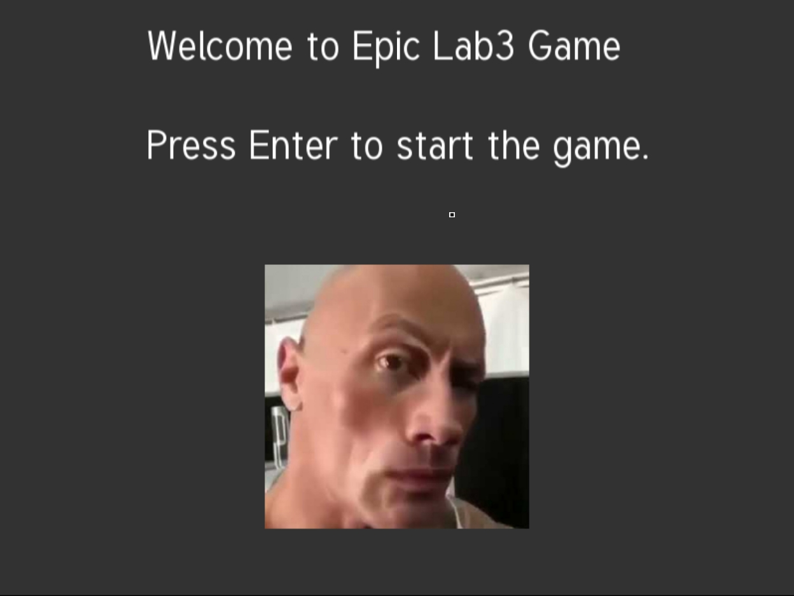
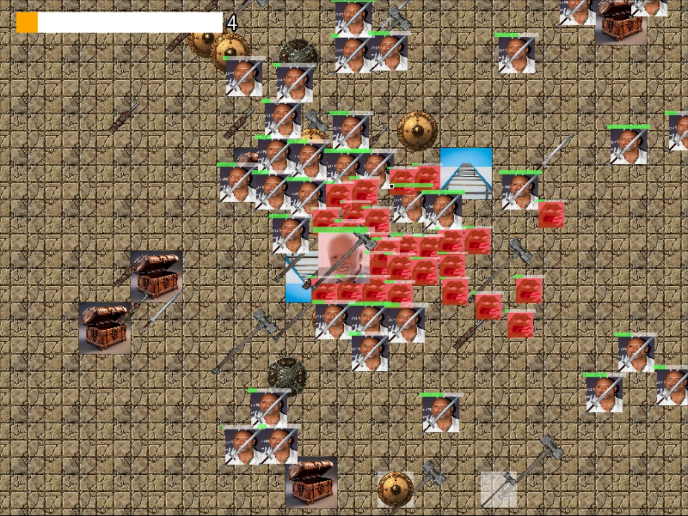
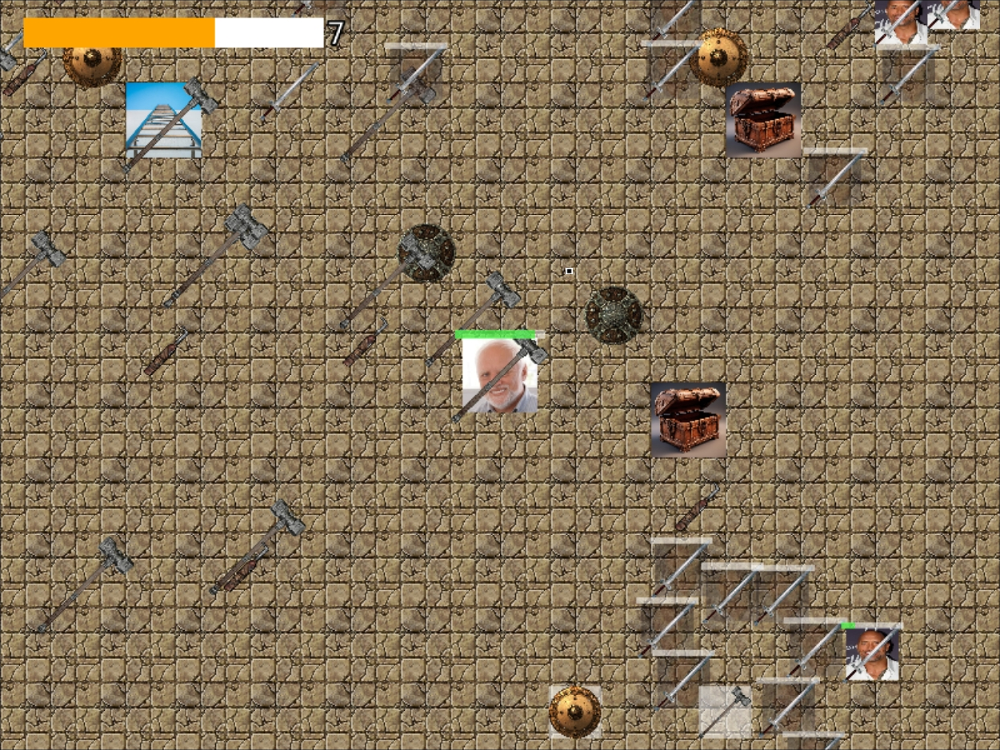

# mephi oop labs

To run a lab, just run `make compile` followed by a `make run` in the folder of the lab. You need a c++ compiler and for some of them you need a additional libraries, all are installed by commands in the respective `Makefile`s, just read through them.

In folder `1` there's simple sparse matrix implementation

In folder `2` I've implemented a simple interpreted language for the task at hand.

In folder `3` I've implemented a simple rouge-like/rpg game with dynamically loaded shared library extensions, multithreading, save/loading, collision system and external file game configuration.

In folder `external_code` I've extended a work of another student.

Game:

https://github.com/user-attachments/assets/938fae7d-9eb6-4169-a9e8-38740ae5f16c

